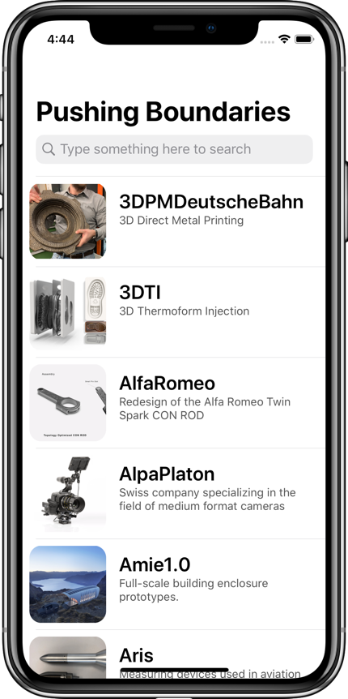
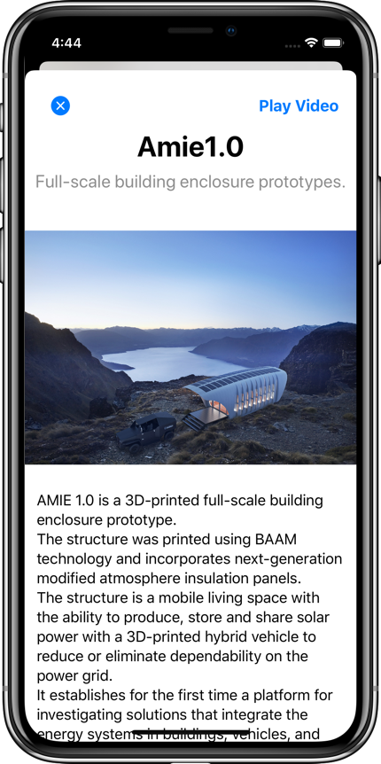

# 3DPCiPAD - PushingBoundaries

PushingBoundaries is an iOS app for the "Pushing Boundaries" 3D-print model exhibition in Germany (2019), which I recently built during my internship. The specs were to build a basic museum app, and later to extend it with augmented reality. I decided to build something a bit more informative, creative, and colourful than just a basic AR app. The 3D models are organized in a table view for easy scrolling and searching.

I'm pleased with how the project came out. I like the app's responsiveness, UI design, and easily-extended architecture. PushingBoundaries was built with Xcode and written entirely in Swift 5; it utilizes Auto Layout for UI design and makes extensive use of UIView animations.  

It has been developed with the iPad in mind, but works equally well on the iPhone.

 

  &nbsp;&nbsp;&nbsp;&nbsp;&nbsp;
&nbsp;&nbsp;&nbsp;&nbsp;&nbsp;
  &nbsp;&nbsp;&nbsp;&nbsp;&nbsp;

  

